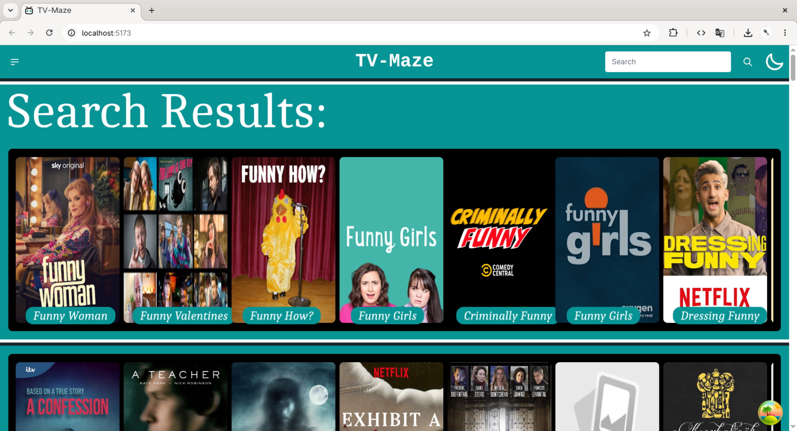
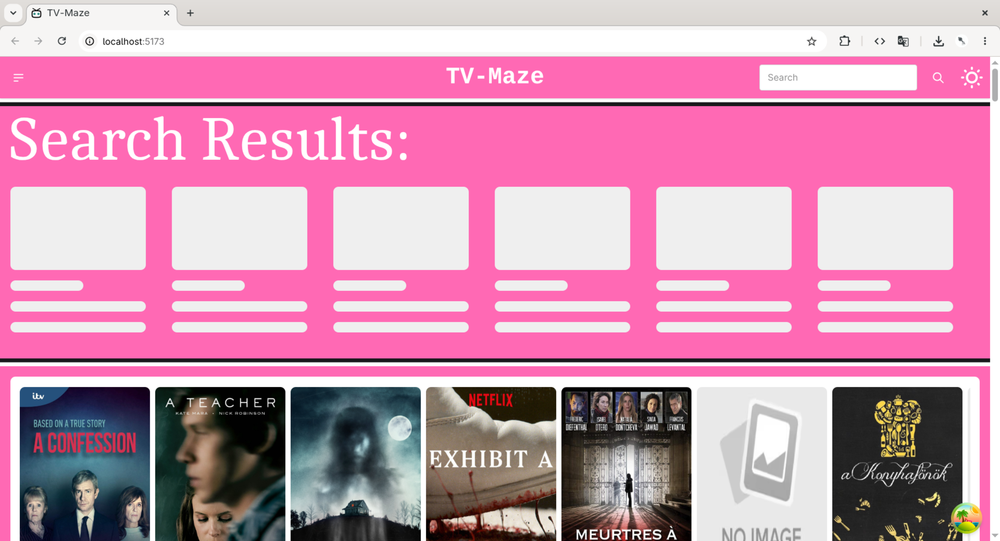

# TV-Maze (Explore TV shows)

Responsive front-end React application to discover tv shows.
Works on @[tvmaze](https://www.tvmaze.com/api)

# Preview:
()

Supported functionalities:
- Show search
- Dark/Light mode
- Loading screen
- Horizontal scroll on cards
- Hover effect

Building Technologies:
- Html
- CSS
- Tailwind CSS
- Daisy UI
- React

React concepts:
- Axios
- Query-hook
- State-hook
- Ref-hook

# Feel free to contribute :)